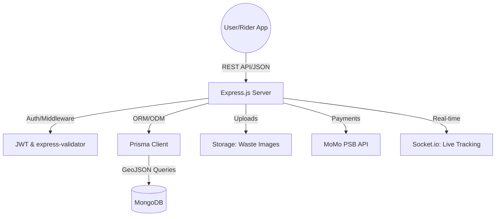
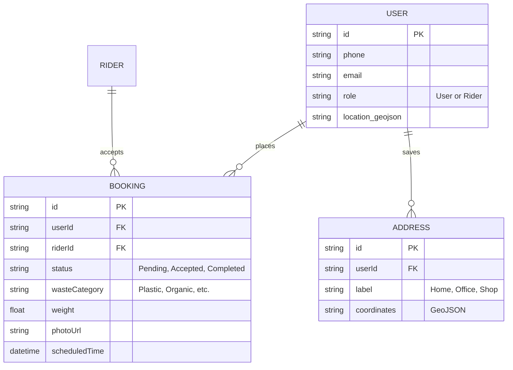
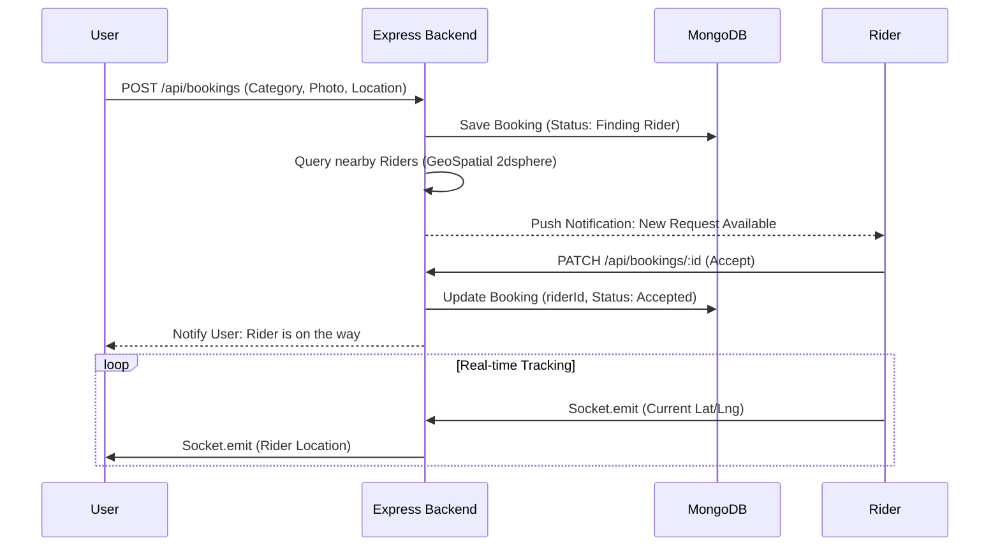

# Borla Backend Architecture

## System Architecture Diagram

---

## Database Schema (ERD)

---

## Booking Flow Sequence

---

## Tech Stack

- **Backend Framework:** Express.js (Node.js)
- **Database:** MongoDB with Prisma ORM
- **Authentication:** JWT (JSON Web Tokens)
- **Real-time:** Socket.io
- **File Storage:** AWS S3
- **Payment Gateway:** MoMo PSB API
- **Validation:** Zod + express-validator
